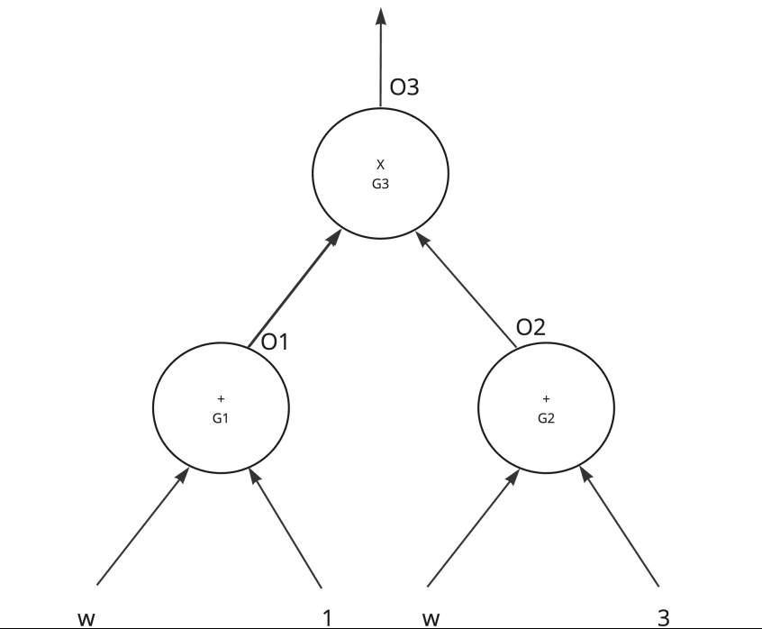

# Given a circuit with 3 gates

1. What polynomial does output O3 represent?
	- O3 represents ploynomial: $(w + 1).(w + 3)$ = $w^2 + 4w + 3$
2. If O3 is 24 find w
	- $w^2 + 4w + 3 = 24$
	- $w^2 + 4w - 21$
	- $(w + 7).(w - 3)$; using polynomial factoring $a+b=4 & ab=-21$
	- $w = 3$ and $w = -7$; for finite field the answer is $w = 3$
3. Write out a constraint for each gate interms of input and output
4. Can you add selector S1, S2, S3 for the constaints written

